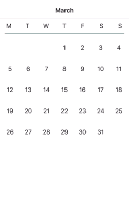
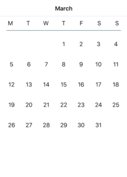

# SListView

<p align="center">
    <a href="http://swift.org">
        
        </a>
        <a href="https://raw.githubusercontent.com/shial4/SLazeKit/master/LICENSE">
            
        </a>
        <a href="https://cocoapods.org/pods/SLSListView">
            
        </a>
        <a href="https://github.com/Carthage/Carthage">
            
        </a>
</p>

Swift list view collection.

<p align="center">


</p>

## 🔧 Installation

**CocoaPods:**

Add the line `pod "SListView"` to your `Podfile`

**Carthage:**

Add the line `github "shial4/SListView"` to your `Cartfile`

**Manual:**

Clone the repo and drag the folder `SListView` into your Xcode project.

**Swift Package Manager:**

Add the line `.package(url: "https://github.com/shial4/SListView.git", from: "0.0.1"),` to your `Package.swift`

**Swift Package Manager in your iOS Project:**
This project demonstrates a working method for using Swift Package Manager (SPM) to manage the dependencies of an iOS project.

<a href="https://github.com/j-channings/swift-package-manager-ios">Example of how to use SPM v4 to manage iOS dependencies</a>

## 💊 Usage

```swift
import UIKit
import SListView

``

Inherit from the `ListViewController`

class CalendarViewController: ListViewController {
    override func viewDidLoad() {
        super.viewDidLoad()
        listView.registerClassForListViewCell(CustomListViewCell.self)
        listView.marginForItem = UIEdgeInsets(top: 8, left: 12, bottom: 8, right: 12)
        listView.scrollDirection = .vertical
        listView.reloadData()
    }
    
    override func listView(_ listView: ListView, didChangeDisplayItemAt index: Int, with offset: Int) {
        //Do your stuff here.
    }
    
    override func listView(_ listView: ListView, willDisplay cell: ListViewCell, at index: Int, with offset: Int) {
        guard let cell = cell as? CustomListViewCell else { return }
        //Do your stuff here.
    }
}
```

Or conform to `ListView` protocols

```swift
class CalendarViewController: UIViewController, ListViewDelegate, ListViewDatasource {
    @IBOutlet weak var listView: ListView!
    
    override func viewDidLoad() {
        super.viewDidLoad()
        listView.registerClassForListViewCell(CalendarMonthViewCell.self)
        listView.marginForItem = UIEdgeInsets(top: 8, left: 12, bottom: 8, right: 12)
        listView.scrollDirection = .vertical
        listView.reloadData()
    }
    
    func listView(_ listView: ListView, didChangeDisplayItemAt index: Int, with offset: Int) {
        //Do your stuff here.
    }
    
    func listView(_ listView: ListView, willDisplay cell: ListViewCell, at index: Int, with offset: Int) {
        guard let cell = cell as? CalendarMonthViewCell else { return }
        //Do your stuff here.
    }
}
```

## ⭐ Contributing

Be welcome to contribute to this project! :)

## ❓ Questions

Just create an issue on GitHub.

## 📝 License

This project was released under the [MIT](LICENSE) license.
